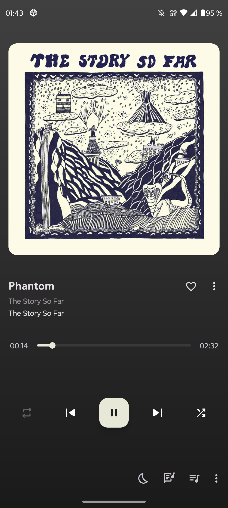
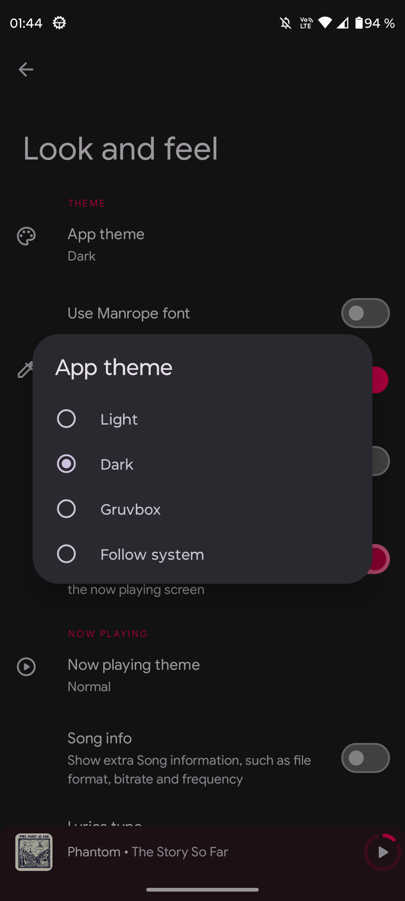
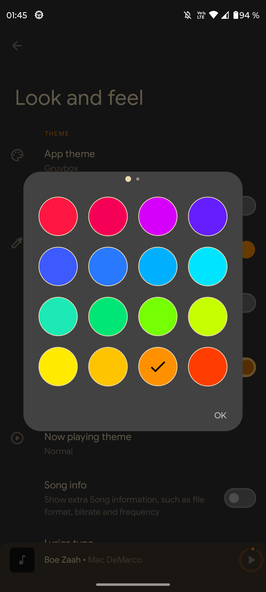
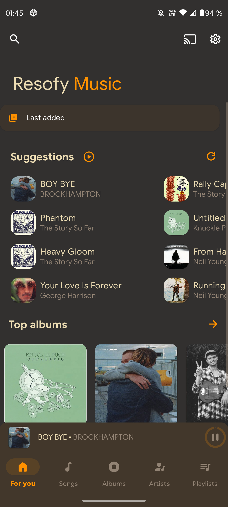

# Resofy Music

A Material Design music player for Android with support for local libraries and self-hosted Subsonic/Navidrome servers.

> Fork of [Retro Music Player](https://github.com/RetroMusicPlayer/RetroMusicPlayer) by Hemanth Savarala.

---

## Screenshots

| Home | Player | Themes | Colors |  Gruvbox |
|:---:|:---:|:---:|:---:|:---:|
|  |  |  |  |  |

---

## Features

**Music sources**
- Local library — songs, albums, artists, playlists, genres, folders
- Subsonic / Navidrome server — browse and stream over the network
- Switch between local and server mode from settings
- Multiple server configurations with connection testing

**Home**
- Daily song suggestions
- Top albums and favorites sections
- Suggested artists of the day (rotates daily)

**Playback**
- 10+ now playing screen styles
- Crossfade and gapless playback
- Playback speed and pitch control
- Synced and unsynced lyrics
- Sleep timer
- Queue management

**Library**
- Smart playlists: Last added, History, Most played
- Tag editor
- Folder-based browsing
- Blacklist folders
- Scrobble support via Subsonic API

**Appearance**
- Dark, Light, Gruvbox and Follow System themes
- Custom accent color picker
- Material You support (Android 12+)
- Adaptive color from album art

**Other**
- Android Auto support
- Chromecast support
- Home screen widgets
- Lock screen controls
- Headset / Bluetooth support
- Driving mode

---

## Download

[GitHub Releases](https://github.com/maurocosentino/Resofy/releases)

---

## Building

```bash
git clone https://github.com/maurocosentino/Resofy.git
cd Resofy
./gradlew assembleDebug
```

Requires Android Studio Hedgehog or newer and JDK 17.

---

## License

Released under the [GNU General Public License v3.0](LICENSE.md).

---

## Credits

- [Retro Music Player](https://github.com/RetroMusicPlayer/RetroMusicPlayer) by [@h4h13](https://github.com/h4h13) and contributors
- [Subsonic API](http://www.subsonic.org)
- [Navidrome](https://www.navidrome.org)