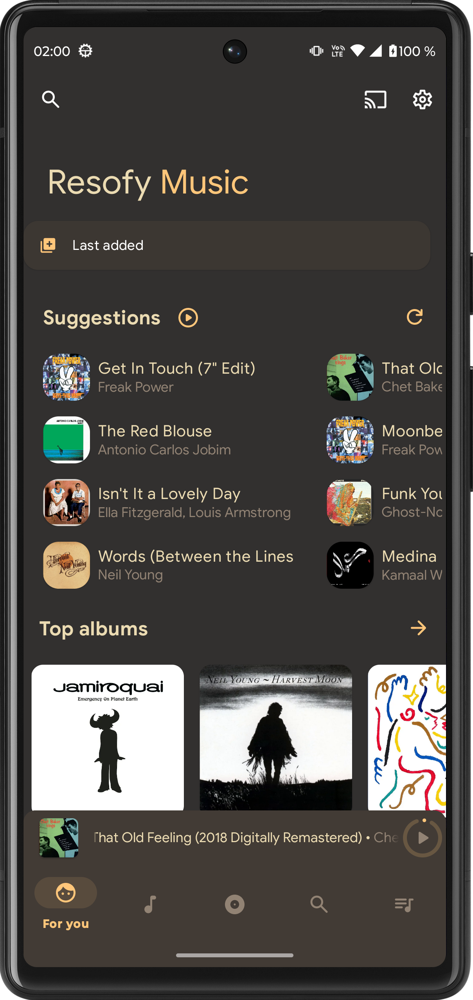
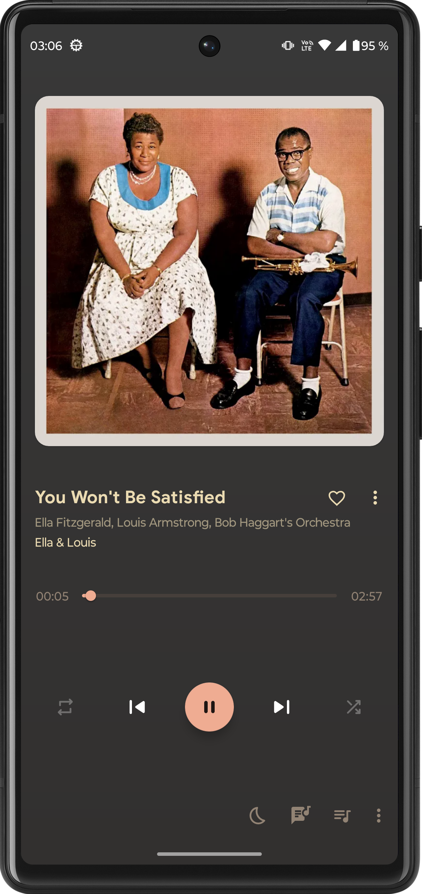
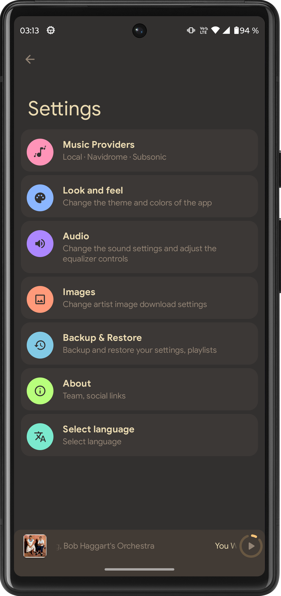

<p align="center">
  <h1 align="center">Resofy Music 🎵</h1>
  <p align="center">A modern Material Design music player for Android with support for local libraries, Navidrome and Subsonic servers.</p>

<p align="center">
  <a href="https://github.com/maurocosentino/Resofy">
    
  </a>
  <a href="https://github.com/maurocosentino/Resofy/blob/master/LICENSE.md">
    
  </a>
  <a href="https://github.com/maurocosentino/Resofy/releases">
    
  </a>
  
</p>

---

## 📱 Screenshots

| Home | Player | Settings |
|:---:|:---:|:---:|
|  |  |  |

---

## ✨ What is Resofy?

Resofy is a fork of [Retro Music Player](https://github.com/RetroMusicPlayer/RetroMusicPlayer) with a focus on combining local music playback with self-hosted streaming servers. It brings together your local library and your Navidrome or Subsonic server in a single, polished Material Design app.

---

## 📦 Features

### 🎵 Music Sources
- Local library playback (songs, albums, artists, playlists, genres, folders)
- **Subsonic / Navidrome server support** — browse and stream your self-hosted music library
- Switch between local and server mode instantly from settings
- Multiple server configurations with connection testing

### 🏠 Home
- Personalized suggestions refreshed daily
- Top albums section (most played)
- Last added albums from your server
- Favorites section with starred songs
- Suggested artists of the day

### ❤️ Favorites
- Star/unstar songs directly from home cards
- Syncs favorites with your Navidrome/Subsonic server via the star API
- Favorite heart icon overlay on album art cards

### 🔍 Search
- Works across both local library and Subsonic server
- Searches songs, albums and artists

### 🎨 Themes
- **Dark** — dark theme with warm tones
- **Light** — clean light theme
- **Gruvbox Dark Soft** — retro warm color scheme inspired by the popular Gruvbox palette
- Material You support on Android 12+
- Adaptive color from album art
- Custom accent color picker

### 🎧 Now Playing
- 10+ now playing screen styles (Normal, Fit, Flat, Color, Material, Classic, Adaptive, Blur, Tiny, Peek and more)
- Adaptive color background from album art
- Synced and unsynced lyrics support
- Sleep timer
- Playback speed and pitch control
- Crossfade support
- Gapless playback

### 📚 Library
- Browse by songs, albums, artists, playlists, genres and folders
- Smart auto playlists: Last added, History, Most played
- Create, edit and import playlists
- Reorderable play queue
- Tag editor
- Scrobble support (Last.fm compatible via Subsonic API)

### ⚙️ Other
- Android Auto support
- Chromecast support
- Home screen widgets
- Lock screen playback controls
- Headset / Bluetooth support
- Driving mode
- Folder-based browsing
- Blacklist folders
- 6 language support: English, Spanish, Portuguese, Japanese, German, French

---

## ⬇️ Download

Get the latest release from [GitHub Releases](https://github.com/maurocosentino/Resofy/releases).

---

## 🛠️ Building

```bash
git clone https://github.com/maurocosentino/Resofy.git
cd Resofy
./gradlew assembleDebug
```

Requires Android Studio Hedgehog or newer and JDK 17.

---

## 🗂️ License

Resofy is released under the GNU General Public License v3.0 (GPLv3).

This project is a fork of [Retro Music Player](https://github.com/RetroMusicPlayer/RetroMusicPlayer) by Hemanth Savarala, also licensed under GPL v3.

See [LICENSE.md](LICENSE.md) for the full license text.

---

## 🙏 Credits

- Original app: [Retro Music Player](https://github.com/RetroMusicPlayer/RetroMusicPlayer) by [@h4h13](https://github.com/h4h13) and contributors
- Subsonic API: [subsonic.org](http://www.subsonic.org)
- Navidrome: [navidrome.org](https://www.navidrome.org)